<div align="center">
  <picture>
    <source media="(prefers-color-scheme: dark)" srcset="assets/neural-banner-dark.svg">
    
  </picture>
</div>

```python
class KayongoBrian(Agent):
    """Machine learning engineer. Trains things until they work."""

    observation_space = ["computer vision", "deep RL", "real-world data"]
    action_space      = ["train", "ship", "teach", "repeat"]
    reward            = "models that actually make it to production"

    def policy(self, state):
        return max(self.ideas, key=lambda a: a.q_value)   # mostly greedy
```

<div align="center">
  <picture>
    <source media="(prefers-color-scheme: dark)" srcset="assets/atari-breakout-dark.svg">
    
  </picture>
</div>

<div align="center">
  <picture>
    <source media="(prefers-color-scheme: dark)" srcset="assets/policy-bars-dark.svg">
    
  </picture>
</div>

<div align="center">
  <sub><code>while alive: explore(); exploit(); log_everything()</code></sub>
</div>
